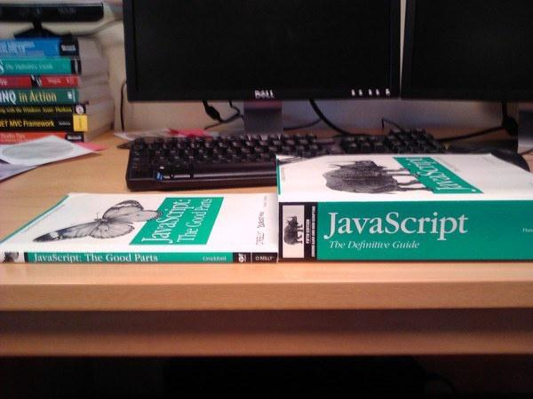

---?image=assets/ts-main.png&size=contain
<br/>
<br/>
[@davidpine7 @fa[external-link]](https://twitter.com/davidpine7) | [davidpine.net @fa[external-link]](http://davidpine.net/)

<br/>

### @size[1.1em](@css[soft-shadow](Making @color[#f7df1e](JavaScript) Tolerable))
---
# @css[blue-glow](What)
> What is @color[#007acc](__TypeScript__) anyways?
---
## @size[.7em](but first ...) @color[#f7df1e](JavaScript)
@ul
- Appeared in @color[magenta](May, 1995) (23 years ago)
- Dynamic, untyped and interpreted language
- Worlds 3<sup style="font-size: 50%">rd</sup> most popular programming language (@color[#f89820](__Java__) and @color[#dc3b00](__SQL__))
@ulend
---

## @color[#f7df1e](JavaScript)
> @color[#f7df1e](__JavaScript__) was originally "prototyped" in 10 days by Brenden Eich
---?image=assets/face-palm.gif&size=auto 90%
<br/><br/><br/><br/><br/><br/>
<h2 class="flash shadow">@color[fuchsia ](... that explains a lot)</h2>

---

## @color[#f7df1e](JavaScript) @color[#96cbfe](`this`)
Example from [MDN](https://developer.mozilla.org/en-US/docs/Web/JavaScript/Reference/Operators/this)
```javascript
// In web browsers, the window object is also the global object:
console.log(this === window); // true

a = 37;
console.log(window.a); // 37

this.b = "MDN";
console.log(window.b)  // "MDN"
console.log(b)         // "MDN"
```
---

## @color[#f7df1e](JavaScript) Books


---?code=source/javascript.js&lang=js
@[1-1](LOL: Illusions Of Equality @css[shaking](@fa[meh-o]))
@[3-13](OMG: Coercion & Arithmetic @css[nodding](@fa[smile-o]))
@[15-18](WTF: We All Do This, Right? @css[shaking](@fa[smile-o]))
@[20-21](TIL: Arrays Are Weird @css[waving](@fa[thumbs-o-up]))
@[23-24](TFW: You Watch <a href="https://www.destroyallsoftware.com/talks/wat" target="_blank">Gary Bernhardt's</a> "wat" Talk @css[nodding](@fa[smile-o]))

---?image=assets/new-sheriff.jpg&size=contain
---
## @color[#007acc](TypeScript)
@ul
- @color[magenta](October, 2012) (17 years after @color[#f7df1e](__JavaScript__)) the superset of @color[#f7df1e](__JavaScript__) was born
- Any valid @color[#f7df1e](__JavaScript__) is also valid @color[#007acc](__TypeScript__)
- Anders Hejlsberg
  - @color[magenta]($1,000,000) signing bonus with @color[gray](__Microsoft__)
@ulend
---

> @fa[quote-left] @color[#f7df1e](__JavaScript__) was intended for 100 to 1,000 lines of code. Now with regularity, applications are 100,000 to 1,000,000 lines of code!

<a href="https://twitter.com/ahejlsberg" target="_blank">Anders Hejlsberg @fa[external-link]</a>
---
## @color[#007acc](TypeScript)
@ul
- @color[#007acc](__TypeScript__) files have the @color[gray](`*.ts`) file extension
- Backwards compatibility to @color[limegreen](ECMAScript 3)
- Any browser, any host, and OS
- Modern (__Node.js__ and __VS/Code__ Tooling)
- Open Source
- Supports latest @color[#f7df1e](__JavaScript__) features
@ulend
---
## @color[#f7df1e](JavaScript) was simply not designed to scale!
---?image=assets/only-you-can-prevent-js.jpg&size=contain

---?image=assets/demo.png&size=contain
# @css[soft-shadow](Demo)
## @css[soft-shadow](From @color[#f7df1e](__JavaScript__) to @color[#007acc](__TypeScript__)  @fa[code])

---?image=assets/a-cure-for-the-common.jpg&size=contain
---
# @css[blue-glow](Why)
> Why should I care about @color[#007acc](__TypeScript__)?
---

> @fa[quote-left] Must have types, power major production apps and our devs should be able to onboard fairly quickly

<a href="https://redditblog.com/2017/06/30/why-we-chose-typescript/" target="_blank">Niranjan Ramadas @fa[external-link]</a>
---

> @fa[quote-left] @color[#007acc](__TypeScript__) Makes Code Easier to Read and Understand 

<a href="https://vsavkin.com/writing-angular-2-in-typescript-1fa77c78d8e8" target="_blank">Victor Savkin @fa[external-link]</a>
---

> @fa[quote-left] A smart static type checker increases our confidence in our code, catches easily made mistakes before they are committed, and makes the code base more self-documenting.

<a href="https://slack.engineering/typescript-at-slack-a81307fa288d" target="_blank">Felix Rieseberg @fa[external-link]</a>
---
# Top 5 @color[tomato](Reasons)
---
## 5. Compatibility (1 / 2)
> @color[#f7df1e](__JavaScript__) is standardized through the @color[limegreen](ECMAScript). Not all browsers support all features of newer @color[limegreen](ECMAScript) standards.
---?image=assets/feature-gap.gif&size=contain
---
## 5. Compatibility (2 / 2)
@color[#96cbfe](`tsconfig.json`)

```js
{
  target: [ 
      'es3',    // You're developing for this target
      'es5', 
      'es6', 
      'es2015', 
      'es2016', 
      'es2017', 
      'es2018',
      'esnext'  // But you want these COOL features!
    ]
}
```
---
## 4. Tooling
> @color[#007acc](__TypeScript's__) language services are a first class citizen

@ul
- @css[ellipsis](Statement Completion)
- Enterprise Refactoring
- __Immediate__ Feedback Loop @color[darkgreen](@fa[refresh fa-spin fast])
@ulend

---?image=assets/tools.png&size=contain
---

## 3. Open Source

@ul
- Learn @color[magenta](*) the things
- Post issues
- Propose __new__ (and _track_) features
@ulend
---
## 2. @color[#007acc](Type) System
@ul
- _Basic_ Types
- _Advanced_ Types
- Classes, Interfaces and Abstract classes
- Generics: @color[#ff73fd](`Script`)`<`@color[#a8ff60](`T `) @color[#007acc](`extends`) @color[#a8ff60](`Type`)`>`
- Type Assertions, Type Guards and Type Aliases
- Polymorphic @color[#96cbfe](`this`)
@ulend
---?image=assets/mind-blown.gif&size=contain
## @css[shadow](@color[magenta](1. Compilation))

---
## @size[.7em](...now) @color[darkorange](what?)
 

---?image=assets/demo.png&size=contain

# @css[soft-shadow](Demo)
## <a href="https://www.typescriptlang.org/play/index.html" target="_blank">@css[soft-shadow](@color[#007acc](TypeScript)<br/>Playground @fa[external-link])</a>
---?image=assets/stead-now.jpg&size=contain

---
# @css[blue-glow](How?)
> How can I @color[#007acc](__TypeScript__)?

---
## @color[gray](@fa[eye]) Basic @color[#007acc](__Types__)
---?code=source/basic.ts&lang=ts
@[1-3](LOL: Interfaces @css[shaking](@fa[meh-o]))
@[5-9](WTF: Implementations @css[nodding](@fa[smile-o]))
@[11-19](OMG: Basic Types @css[nodding](@fa[smile-o]))
@[21-30](TIL: Enums @css[waving](@fa[thumbs-o-up]))
@[31-36](TFW: You Mess With Your Friends @css[nodding](@fa[smile-o]))

---
# File @fa[file-code-o] @color[tomato](Extensions)
---?image=assets/file-extensions.png&size=contain

---?image=assets/demo.png&size=contain
# @css[soft-shadow](Demo)
## @css[soft-shadow](Advanced @color[#007acc](Types)  @fa[code])

---
# Adoption @color[#cb3837](@fa[cloud-download])
---?image=assets/adoption.png&size=contain

---
## Thank you
### [bit.ly/TypeScriptSlides](http://bit.ly/TypeScriptSlides)

<br/>
[@davidpine7 @fa[external-link]](https://twitter.com/davidpine7) | [davidpine.net @fa[external-link]](http://davidpine.net/)